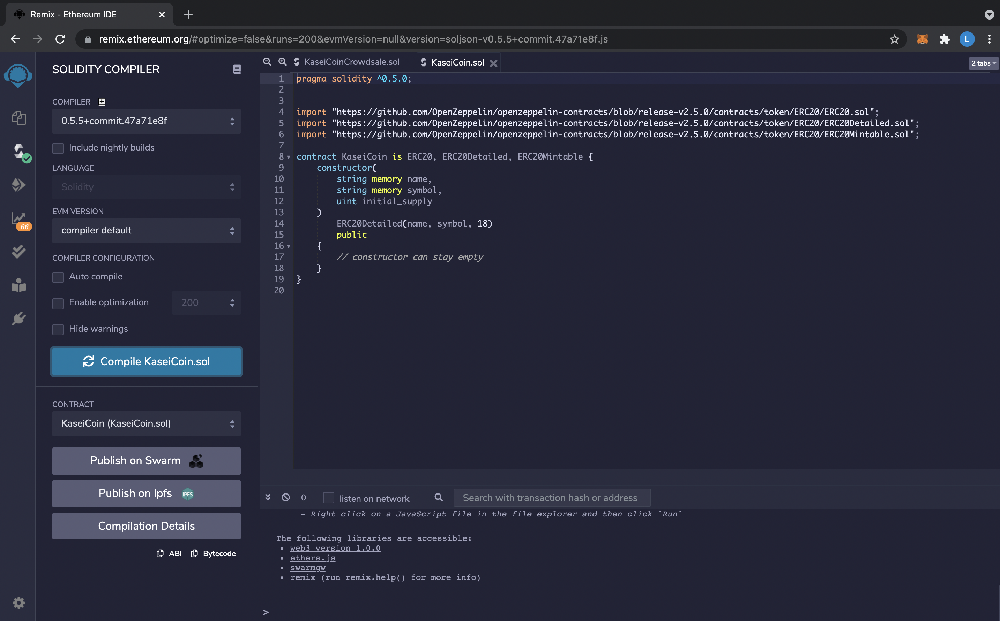
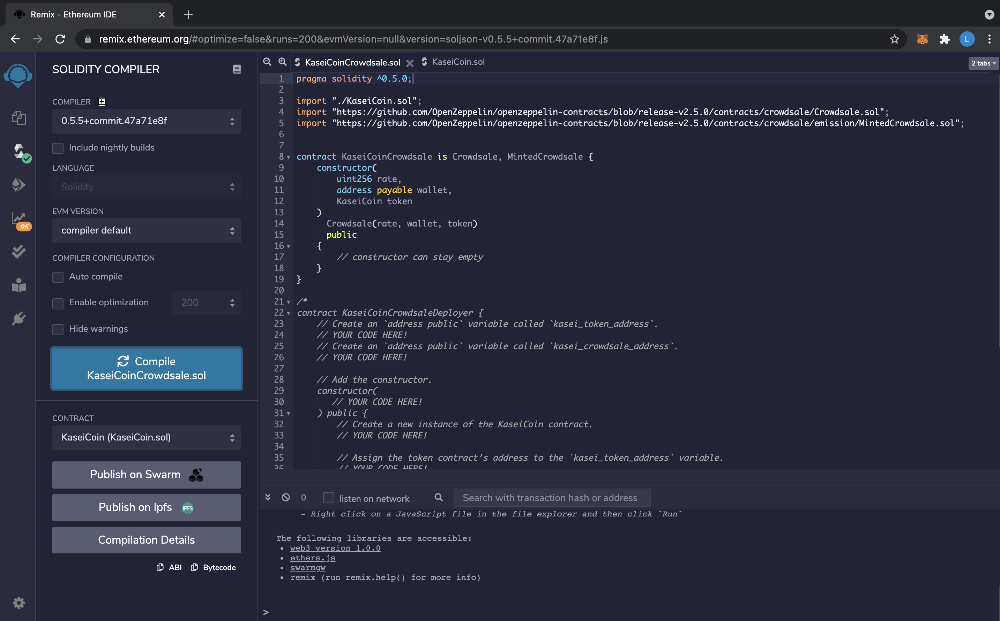
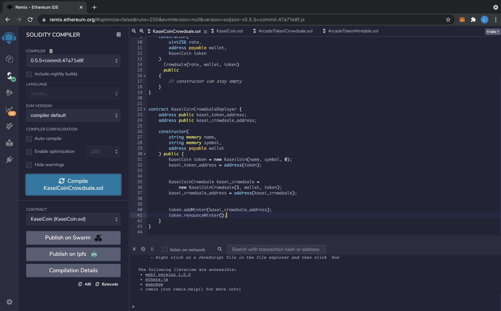
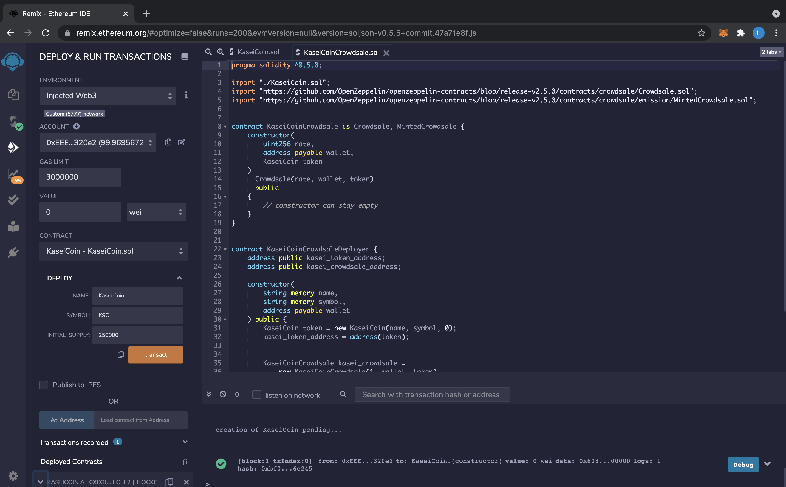
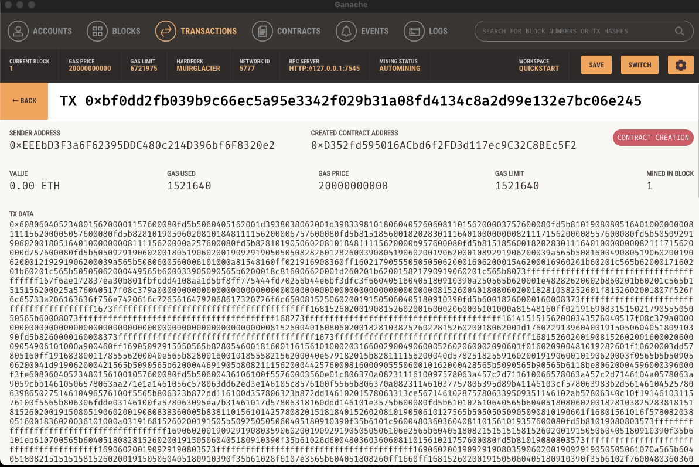
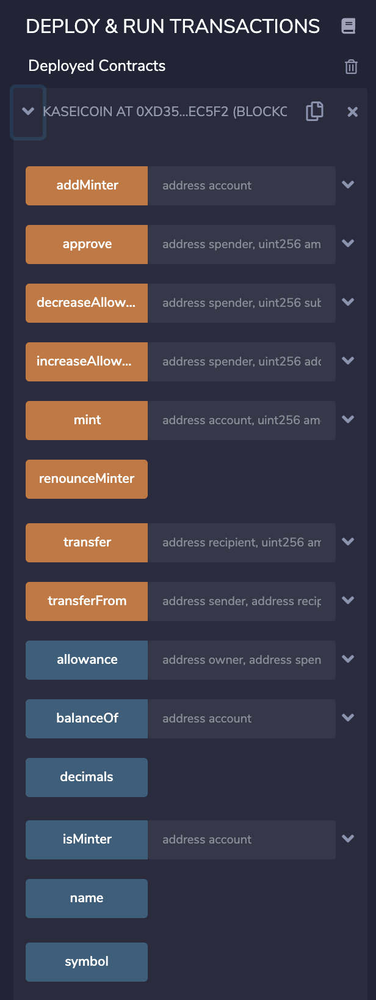
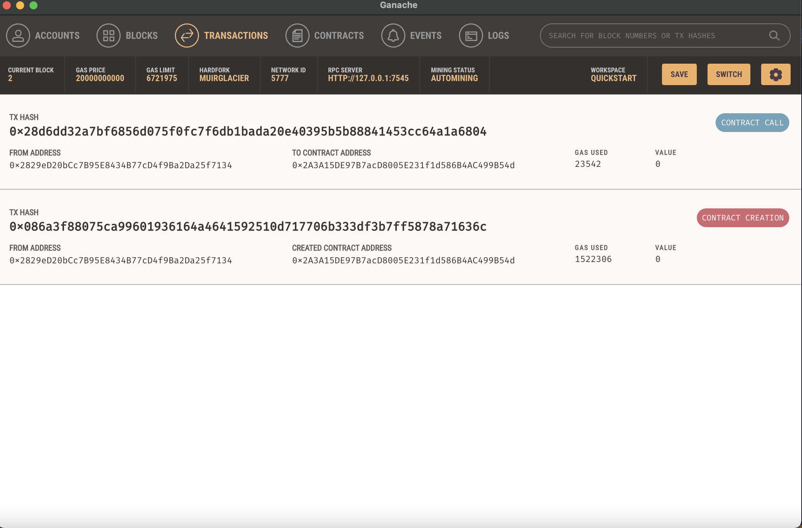

# Martian Token Crowdsale

We are creating a fungible token that is ERC-20 compliant and that will be minted by using a `Crowdsale` contract from the OpenZeppelin Solidity library. The contract will allow the tokens to be minted automatically, will allow users to send ether to the contract and in return receive KaseiCoin tokens. 

## Technologies

The project uses the following applications:
* remix.ethereum.org: open source web application for smart contact development using Solidity
* Ganache: personal blockchain for rapid Ethereum distributed application development
* MetaMask: sofware cryptocurrency wallet to interact with the Ethereum blockchain

## Evaluation Evidence

## Contributors

Developed by Lucas Manning, Email: AbsurdSophsit@gmail.com

## License

UC Berkeley Extension FinTech Program
